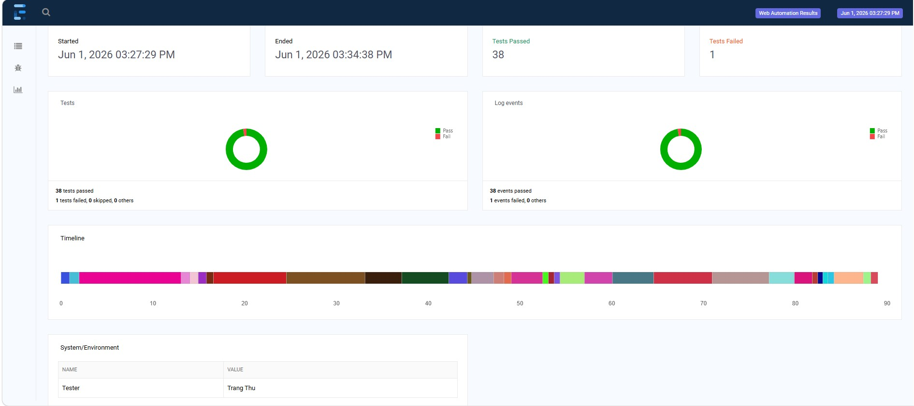

# 🚀 Selenium Java Automation Testing Framework

[](https://www.oracle.com/java/)
[](https://www.selenium.dev/)
[](https://testng.org/)
[](https://maven.apache.org/)

Một dự án thiết kế Framework kiểm thử tự động toàn diện được xây dựng từ cơ bản đến nâng cao. Dự án mô phỏng cách giải quyết các bài toán kịch bản thực tế (Web UI, Data-Driven, Dynamic Elements, Advanced Interactions) trên nền tảng thực hành **The Internet Herokuapp**, tuân thủ nghiêm ngặt các tiêu chuẩn kiến trúc công nghiệp.

---

## 🏗️ Kiến Trúc Dự Án (Architecture & Design Pattern)

Dự án áp dụng mô hình thiết kế mẫu **Page Object Model (POM)** kết hợp với cấu trúc **Data-Driven Testing**, giúp tách biệt hoàn toàn giữa tầng xử lý Logic Giao diện và tầng Kịch bản Kiểm thử.

### Cấu trúc thư mục đầy đủ (Project Structure)
```text
src/main/java
└── com.thutrang.automation
    ├── base
    │   ├── BasePage.java             # Chứa các hàm wrapper tương tác cốt lõi (Smart Waits)
    │   └── TestListener.java         # Bộ lắng nghe sự kiện, tự động chụp ảnh màn hình khi Fail
    └── pages
        ├── CheckboxesPage.java       # Kiểm tra trạng thái và tương tác Checkbox
        ├── DropdownPage.java         # Sử dụng Select class để quản lý thẻ dropdown
        ├── FormAuthenticationPage.java # Tương tác biểu mẫu điền thông tin Đăng nhập
        ├── InputsPage.java           # Kiểm thử các kiểu dữ liệu nhập vào ô Input
        ├── JavaScriptAlertsPage.java # Xử lý driver.switchTo().alert() (Accept/Dismiss)
        ├── DynamicLoadingPage.java   # Áp dụng WebDriverWait xử lý phần tử bất đồng bộ
        ├── DynamicControlsPage.java  # Kiểm tra sự tồn tại/biến mất của phần tử trong DOM
        ├── HoversPage.java           # Mô phỏng hành động di chuột qua Actions Class
        ├── DragAndDropPage.java      # Giả lập kéo thả phần tử từ điểm A sang điểm B
        ├── MultipleWindowsPage.java  # Quản lý luồng nhảy qua lại giữa các Tab trình duyệt
        ├── FramesPage.java           # Di chuyển vùng quét driver qua driver.switchTo().frame()
        ├── FileUploadPage.java       # Gửi đường dẫn tệp trực tiếp vào input element
        ├── FileDownload.java         # Xử lý IO, quản lý tệp và loại trừ file tạm (.crdownload)
        ├── SortableDataTables.java   # Dò tìm dữ liệu bảng động qua XPath Axes
        ├── BrokenImagesPage.java     # Sử dụng HTTPClient để kiểm tra Status Code của hình ảnh
        └── ShadowDOM.java            # Bẻ khóa cây cấu trúc ẩn thông qua SearchContext
src/test/java
└── com.thutrang.automation
    ├── base
    │   └── BaseTest.java             # Khởi tạo WebDriver, cấu hình ChromeOptions nâng cao
    └── tests
        ├── CheckboxesTest.java
        ├── DropdownTest.java
        ├── FormAuthenticationTest.java
        ├── InputsTest.java
        ├── JavaScriptAlertsTest.java
        ├── DynamicLoadingTest.java
        ├── DynamicControlsTest.java
        ├── HoversTest.java
        ├── DragAndDropTest.java
        ├── MultipleWindowsTest.java
        ├── FramesTest.java
        ├── FileUploadTest.java
        ├── FileDownloadTest.java
        ├── SortableDataTablesTest.java
        ├── BrokenImagesTest.java
        └── ShadowDOMTest.java
testng.xml                            # Quản lý luồng thực thi và đăng ký Hệ thống Báo cáo
pom.xml                               # Quản lý các dependencies và cấu hình build hệ thống
```
## 🛠️ Công Nghệ & Công Cụ Sử Dụng (Tech Stack)

* **Ngôn ngữ chính:** Java
* **Thư viện lõi:** Selenium WebDriver (v4.x) 
* **Kiểm thử cốt lõi:** TestNG (Quản lý Test Cases, Assertions, DataProvider) 
* **Quản lý dự án & Build:** Apache Maven 
* **Quản lý Trình duyệt:** WebDriverManager (Tự động hóa quản lý driver nhị phân) 
* **Hệ thống Báo cáo:** Extent Reports (Tự động chụp ảnh giao diện khi lỗi, kết xuất đồ thị trực quan) 

## 📊 Giao diện Báo cáo Tự động (Extent Reports Dashboard)


## ⚙️ Hướng Dẫn Cài Đặt & Chạy Dự Án (Getting Started)

### Yêu cầu hệ thống
Đã cài đặt Java JDK 11 hoặc 17
Đã cài đặt Apache Maven
Trình duyệt Google Chrome

### Các bước thực thi
1.  **Clone dự án về máy cục bộ:**
git clone <https://github.com/HuynhThiThuTrang2002/the-internet-automation-showcase>
2.  **Chạy toàn bộ Suite kiểm thử qua Terminal (Maven CLI):**
```bash
    mvn clean test
```
3.  **Xem báo cáo kiểm thử:**
* Sau khi quá trình thực thi kết thúc, truy cập thư mục: `target/ExtentReport.html`.*
* Mở file trên bằng trình duyệt để xem biểu đồ và hình ảnh minh họa trạng thái.*
  
---

## 👩‍💻 Thông Tin Tác Giả (Author)

* **Họ và tên:** Huỳnh Thị Thu Trang
* **Vị trí hướng tới:** Automation Testing Engineer / Quality Control Professional
* **Kỹ năng bổ trợ:** Kiểm thử thủ công (Web/Mobile/SDK), Quản lý vòng đời lỗi (Jira/Azure DevOps), Phân tích yêu cầu nghiệp vụ.
* **Liên hệ:** [httt5050@gmail.com] 

---
